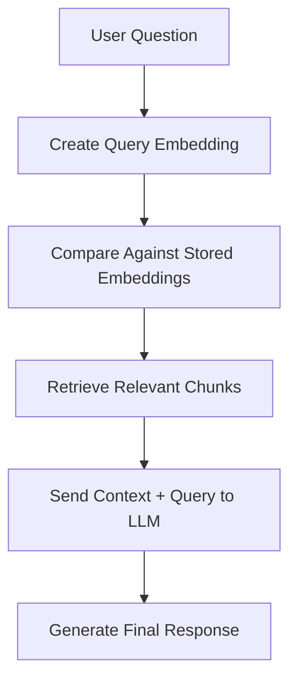
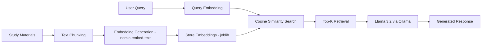
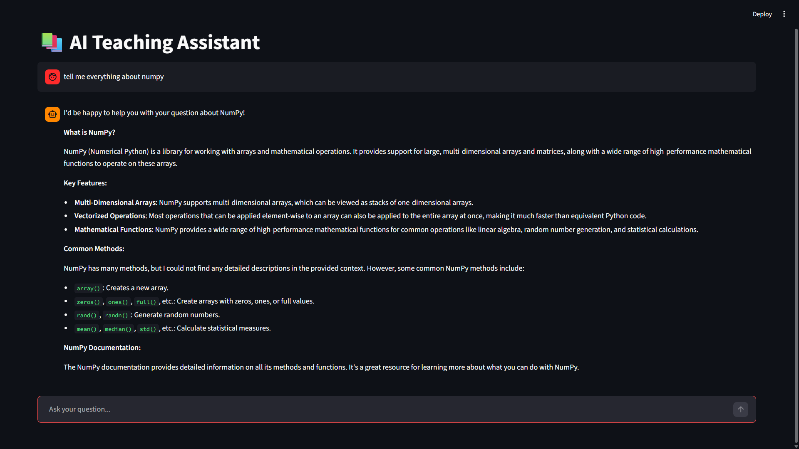
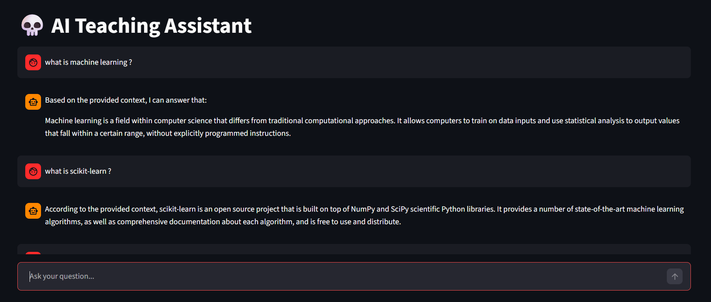

#  RAG-Based AI Teaching Assistant

A Retrieval-Augmented Generation (RAG) based AI Teaching Assistant built using Python, Ollama, Streamlit, and semantic search.

This project answers questions from custom study materials by retrieving relevant context using embeddings and generating grounded responses using a local Large Language Model (LLM).

---

#  Features

*  Semantic search using embeddings
*  Local LLM inference using Ollama
*  Local embedding storage using Joblib
*  Context-aware question answering
*  Similarity-based retrieval with cosine similarity
*  Threshold filtering to reduce hallucinations
*  Streamlit-based ChatGPT-like UI
*  Fully local execution (No paid APIs required)

---

#  How It Works

The system follows a Retrieval-Augmented Generation (RAG) pipeline:



---

#  Project Architecture



---

#  Tech Stack

## Frontend

* Streamlit

## Backend

* Python

## Embedding Model

* nomic-embed-text

## LLM

* llama3.2

## LLM Runtime

* Ollama

## Similarity Search

* Cosine Similarity

## Embedding Storage

* Joblib

## Libraries Used

* scikit-learn
* pandas
* numpy
* requests
* streamlit

---

# 📂 Project Structure

# 📂 Project Structure

```text
RAG-BASED Project/
│
├── app.py
├── rag_pipeline.py
├── read_chunks.py
├── pdf_to_json.py
├── process_videos.py
├── speech_to_text.py
├── requirements.txt
├── README.md
├── .gitignore
│
├── jsons/
```

---

#  Installation & Setup

## 1. Clone Repository

```bash
git clone https://github.com/Harsh-Tripathi583/rag-ai-teaching-assistant.git
cd rag-ai-teaching-assistant
```

---

## 2. Create Virtual Environment

### Windows

```bash
python -m venv .venv
.venv\Scripts\activate
```

---

## 3. Install Dependencies

```bash
pip install -r requirements.txt
```

---

## 4. Install Ollama

Download Ollama:

[https://ollama.com](https://ollama.com)

---

## 5. Pull Required Models

```bash
ollama pull llama3.2
ollama pull nomic-embed-text
```

---

## 6. Run Streamlit App

```bash
streamlit run app.py
```

---

#  Screenshots

## Chat Interface

## Chat Interface



## Example 2



---

#  Retrieval Strategy

The project uses:

* embedding-based semantic search
* cosine similarity retrieval
* top-k chunk selection
* similarity threshold filtering

Threshold filtering helps reduce hallucinations by rejecting low-relevance queries.

---

# ⚠️ Current Limitations

This project is Version 1 of the system and currently has some limitations:

* linear similarity search
* no vector database
* retrieval noise for large datasets
* limited scalability
* no reranking system
* no conversational memory

These limitations motivated the development of Version 2.

---

#  Planned Improvements (V2)

* PDF-only knowledge system
* FAISS vector database
* Better embedding models (BGE)
* Improved chunking strategy
* Metadata support
* Faster retrieval
* Source citations
* Better UI and scalability

---

#  Key Concepts Used

* Retrieval-Augmented Generation (RAG)
* Embeddings
* Semantic Search
* Cosine Similarity
* Prompt Engineering
* Local LLM Inference
* Hallucination Reduction
* Streamlit UI Development

---

#  Learning Outcomes

Through this project, I explored:

* how RAG systems work internally
* embedding generation and retrieval
* semantic search pipelines
* prompt engineering techniques
* retrieval quality tuning
* hallucination control strategies
* local LLM integration using Ollama

---

# 🧑‍💻 Author

Harsh Tripathi

GitHub:
[https://github.com/Harsh-Tripathi583](https://github.com/Harsh-Tripathi583)

---

# ⭐ Acknowledgements

This project uses:

* Ollama
* Streamlit
* scikit-learn
* Open-source embedding models
* Llama 3.2
